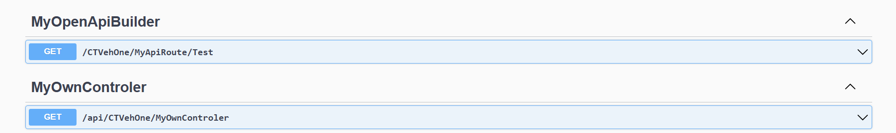

# General Controllers

There are two types of controllers in AppEngine: controllers with SAP authorization and controllers without authorization. In a secure controller, connection-scoped services are injected.

## Classic Controllers

- **Secure Controller**: Use `AppEngineSecureController` for authorized access.
- **Non-Authorized Controller**: Use `AppEngineController`.

Routes will follow the pattern `api/<PluginRoutePrefix>`.

Example:

```csharp
public class MyOwnController : AppEngineSecureController
{
    [HttpGet]
    public string Get()
    {
        return "Hello World!";
    }
}
```

To access services, use `GetService<T>` in the constructor. Only application-scope services are accessible.

## Minimal API Controllers

To create a minimal API controller, inherit from `AeSecureMinimalApiEndpointBuilder` or `AeMinimalApiEndpointBuilder`. Use the `Route` property to set up the route.

Example:

```csharp
public class MyOpenApiBuilder : AeSecureMinimalApiEndpointBuilder
{
    public override string Route => "MyApiRoute";

    public override void Configure(RouteGroupBuilder endpointRouteBuilder)
    {
        endpointRouteBuilder.MapGet("/Test", Test);
    }

    private IResult Test([FromServices] SecureScopeService<ITranslationService> translationService)
        => Results.Ok(translationService.Value.GetTranslatedMessage("VehOne.VinIsMissing"));
}
```

To access services, use `SecureScopeService<T>`.

## Swagger Integration

All controllers, including minimal API controllers, are visible in Swagger:


