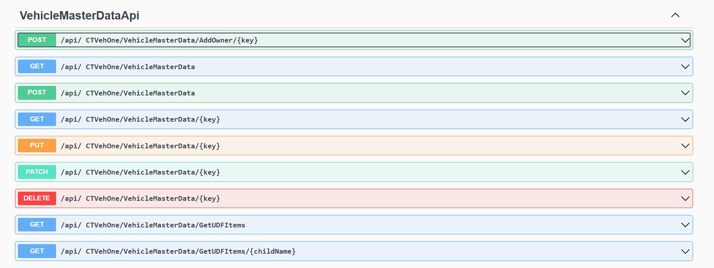
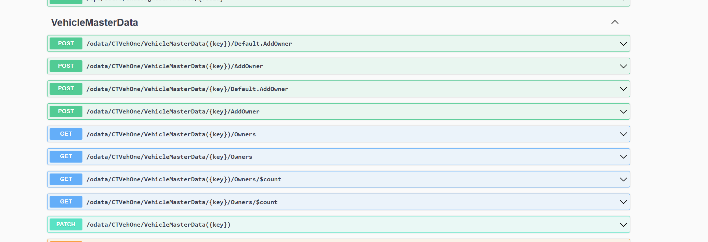

# Extending Generated OData or CRUD Controllers

Generated controllers are public partial classes, allowing you to add custom endpoints by creating a file with your own endpoint code.

## Extending CRUD Controllers

To add a custom endpoint to a generated controller:

```csharp
partial class VehicleMasterDataApiController
{
    [HttpPost]
    [Route("AddOwner/{key}")]
    public async Task<ActionResult<VehicleMasterData>> AddOwner(string key, [FromBody] Owner vehicleMasterData)
    {
        var udo = await GetEntityByKeyAsync(key);
        udo.Owners.SetCurrentLine(udo.Owners.Count - 1);
        if (udo.Owners.IsRowFilled())
            udo.Owners.Add();
        udo.Owners.U_OwnerName = vehicleMasterData.Name;
        udo.Owners.U_OwnerAddress = vehicleMasterData.Address;
        
        var result = udo.Update();
        return result != 0 ? BadRequest("Error") : Ok(Serializer.ToModel(udo));
    }
}
```

All controllers are visible in Swagger:



## Extending OData Controllers

For OData controllers, adding custom methods requires model description setup. To create a similar method for OData:

### 1. Extend Model Definition

Override `BuildCustomEdmModel` in the `PluginInfo` class to register the entity action:

```csharp
public override void BuildCustomEdmModel(ODataConventionModelBuilder builder)
{
    var action = builder.EntityType<VehicleMasterData>().Action("AddOwner");
    action.Parameter<Owner>("owner");
    action.ReturnsFromEntitySet<VehicleMasterData>("VehicleMasterData");
}
```

### 2. Add Method to OData Controller

Create a partial class of the generated controller and add the `AddOwner` method:

```csharp
[HttpPost]
public async Task<IActionResult> AddOwner([FromODataUri] string key, ODataActionParameters parameters)
{
    if (!parameters.TryGetValue("owner", out var cowner) || !(cowner is COwner owner))
    {
        return BadRequest("Owner is required");
    }

    var udo = await GetEntityByKey(key);
    if (udo == null)
    {
        return NotFound();
    }

    udo.Owners.SetCurrentLine(udo.Owners.Count - 1);
    if (udo.Owners.IsRowFilled())
    {
        udo.Owners.Add();
    }

    udo.Owners.U_OwnerName = owner.Name;
    udo.Owners.U_OwnerAddress = owner.Address;

    var result = udo.Update();
    return result != 0 ? BadRequest("Error updating the entity") : Ok(Serializer.ToModel(udo));
}
```

All controllers are visible in Swagger:


